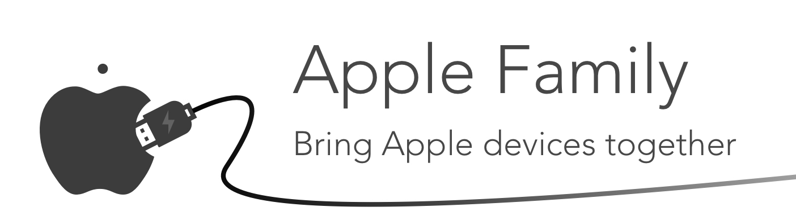

 
# Apple Family 


A simple framework that brings Apple devices together - like a family. It will automatically use bluetooth, wifi, or USB to connect and communicate with other Apple devices and share information. Currently supports iOS and macOS.

This library is a combination of 2 others I wrote: [Apple Signal](https://github.com/kirankunigiri/Apple-Signal) for wifi and bluetooth communication, and [Peertalk Simple](https://github.com/kirankunigiri/peertalk-simple) for USB communication. Check them out if you only want one of these features.

## Demo

Coming Soon


## Installation

Grab the files from the source folder and drag them to your project! You also need to have [peertalk](https://github.com/rsms/peertalk) by Rasmus installed.


## Example

Family is simple to setup. Just start the connection, and you can start sending and receiving data! **Check out the  Xcode demo project for a full implementation .**

#### Setup

Start the connection. Specify a port number, which can be any 4 digit number, and a service type, which is a string limited to 15 characters and 1 hyphen. In order to be discovered, a device must use the same port number and service type. There are also multiple connection types for wifi/bluetooth connectivity. Check the [Signal](https://github.com/kirankunigiri/Apple-Signal) docs for a description of each Signal type.

```swift
Family.instance.delegate = self
Family.instance.initialize(portNumber: 2345, serviceType: "family-example", signalType: .Automatic)
```

Next, we also need to run a method in the App Delegate when the app restarts because the usb connection automatically disconnects when the iPhone is put to sleep. 

```swift
func applicationDidBecomeActive(_ application: UIApplication) {
    Family.instance.reconnect()
}
```

#### Send Data

In Family, you can add a tag to the data you send so that the receiver knows what the data is. You can create a `UInt32` enum to manage them. Here's an example:

```swift
enum DataType: UInt32 {
    case string = 100
    case image = 101
}
```

Send some text, and specify its type using our enum. Family automatically converts objects to data using `NSKeyedArchiver`, so if you want to send your own data, use the `sendData` method instead.

```swift
Family.instance.sendObject(object: "Hello World!", type: DataType.string.rawValue)
```

#### Receive Data (Protocol)

The protocol conformation. We get the data, check its type, convert it back to the according object, and update our UI. The class has an extension to the Data class - the method `convert()` - that uses the NSKeyedArchiver class to convert data back into the object you need. You can also update the list of connected devices with the second method.

```swift
func family(didReceiveData data: Data, ofType type: UInt32) {
    if type == DataType.string.rawValue {
        let string = data.convert() as! String
    } else if type == DataType.image.rawValue {
        let image = UIImage(data: data)
    }
}

func family(connectedDevicesChanged devices: [String]) {}
```

And we just setup communication session between devices. It's that simple!


## Contribute
Feel free to to contribute to the project with a pull request or open up an issue for any new features or bug fixes.