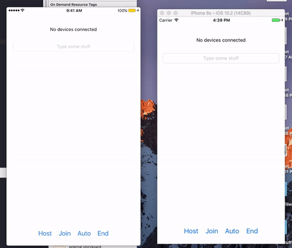

 
# Apple Family 


A simple framework that brings Apple devices together - like a family. It will automatically use either bluetooth or wifi to connect multiple Apple devices and share information. Currently supports iOS and macOS.

## Demo

 

## Installation

Grab the Family-iOS or Family-Mac folder from the Source folder, and drag it into your project!

## Guide

Family uses the Multipeer Connectivity library by Apple, and simplifies the process. The process of making a session is overcomplicated, and their library of UI elements used to host/invite other devices is often slow or does not work at all. So, this library helps fix that with a much simpler session process along with custom UI elements.

### Methods and Propties

  This library has support on both iOS and macOS, but the UI elements have not yet been implemented on the macOS version. Thus, **the `inviteUI()` and `acceptUI` are currently only available on the iOS version.**

**Setup**

`init(serviceType: String)` - Specify a name for the signal.
**Limited to one hyphen (-) and 15 characters.**
**Devices can only see each other if they have the same service name.** This means that you can use a static string to allow all devices see each other, or you can also add in password functionality by making the user input a custom service name. If you ever want to change this, just reinitialize the family object.

`init(serviceType: String, deviceName: String)` - Specify a service type, but also use a custom name. This usually defaults to whatever the name of the device is.

**Connect**

`autoConnect()` - The easiest and fastest way to connect. Automatically connects all devices also running this method (on the same service type) together.

`inviteAuto()` - Automatically invites all detected devices, and continues to look for more until stopped

`inviteUI(), iOS Only` - This method brings up a custom view where you can take a look at all available devices, and invite ones by tapping on them. This view can be fully customized by editing the Family.storyboard source file or the `InviteTableViewController` class.

`acceptAuto()` - Automatically accepts any invites received until stopped

`acceptUI(), iOS Only` - In the protocol method, `receivedInvitation`, you will be given a UIAlertController that you can present. The user can then accept or decline the invitation.

**Stop Services**

`stopInviting()` and `stopAccepting` - Stops the invitation and accept services

`stopSearching()` - Stops both inviting and accept services

`disconnect()` - Disconnects the user from the connected session

`shutDown()` - Shuts down all family services. Stops searching and disconnects.

**Data**

`sendData(object: Any)` - Pass in any object to be sent to all other connected devices. It works by converting it to NSData and then sending it. If you want to send multiple objects, the best way would be to use a single container class.

`convert(), Data class extension` - This is a method that can be used to convert data that you have received from another device back into a useful object. It will return as an Any object, but you can cast it into the right class.

`connectionTimeout, default is 10` - The time (in seconds) a device can spend attempting to connect before quitting.


### Protocol
You must assign a class to the `FamilyDelegate` and conform to its protocol. There are 2 methods that provide you with useful information. These methods run in the background, so **make sure that you use the main thread for any UI changes.**

`receivedData(data: Data)` - This runs whenever data has been broadcasted to all devices. You can use the Data extension method `convert()` in order to cast it back into a specific class.

`receivedInvitation(device: String, alert: UIAlertController?)` - Runs whenever the device has received an invitation. `device` is the sender's name, and the alert will only exist if you used `inviteUI()`

`deviceConnectionsChanged(connectedDevices: [String])` - Runs whenever a device has connected/disconnected. It gives you the new list of connected device names.

### Example

This example can also be found in the demo Xcode project. 

The initialization, pherhaps in the `viewDidLoad()` method.

```swift
// Create the family instance
let family = Family(serviceType: "family-demo")

// Start connecting all devices
family.autoConnect()
```

Send the text from a text field. Maybe on a button press.

```swift
family.sendData(object: textField.text!)
```

The protocol conformation. Get the data, convert it back to a string, and update our UI.

```swift
func receivedData(data: Data) {
    OperationQueue.main.addOperation {
        let string = data.convert() as? String
        self.textLabel.text = string
    }
}
```

And we just setup a session where people can connect and send texts to each other. It's that simple!

## Coming Soon

This project is currently at minimum functionality. It currently can just connect all users with the same service name, and send data between them. Soon, the following features will be added.

- [x] Quick auto connect
- [x] Simple data communication
- [x] iOS UI elements
- [ ] macOS UI elements
- [ ] Simple streaming